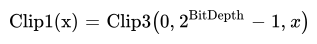
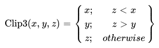
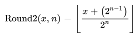

## Conventions

### General

The mathematical operators and their precedence rules used to describe this
Specification are similar to those used in the C programming language.
However, the operation of integer division with truncation is specifically
defined.

When a variable is said to be representable by a signed integer with `x` bits,
it means that the variable is greater than or equal to `-(1 << (x-1))`, and that
the variable is less than or equal to `(1 << (x-1))-1`.

The key words "must", "must not", "required", "shall", "shall not",
"should", "should not", "recommended",  "may", and
"optional" in this document are to be interpreted as described in
RFC 2119.

### Arithmetic operators

|:--------:| ------- |
| +        | Addition
| –        | Subtraction (as a binary operator) or negation (as a unary prefix operator)
| *        | Multiplication
| /        | Integer division with truncation of the result toward zero. For example, `7/4` and `-7/-4` are truncated to `1` and `-7/4` and `7/-4` are truncated to `-1`.
{:.table .table-sm .table-bordered .table-nohead }

### Logical operators

|:--------:| ------- |
| a && b   | Logical AND operation between `a` and `b`
| a \|\| b | Logical OR operation between `a` and `b`
| !        | Logical NOT operation.
{:.table .table-sm .table-bordered .table-nohead }


Note escaped pipe characters in above syntax table.


### Relational operators

|:--------:| ------- |
| >        | Greater than
| >=       | Greater than or equal to
| <        | Less than
| <=       | Less than or equal to
| ==       | Equal to
| !=       | Not equal to
{:.table .table-sm .table-bordered .table-nohead }

### Bitwise operators

|:--------:| ------- |
| &        | AND operation
| \|       | OR operation
| ^        | XOR operation
| ~        | Negation operation
| a&nbsp;\>\>&nbsp;b | Shift `a` in 2's complement binary integer representation format to the right by `b` bit positions. This operator is only used with `b` being a non-negative integer. Bits shifted into the MSBs as a result of the right shift have a value equal to the MSB of `a` prior to the shift operation.
| a&nbsp;\<\<&nbsp;b | Shift `a` in 2's complement binary integer representation format to the left by `b` bit positions. This operator is only used with `b` being a non-negative integer. Bits shifted into the LSBs as a result of the left shift have a value equal to `0`.
{:.table .table-sm .table-bordered .table-nohead }


Note escaped pipe and greater-than characters in above syntax table.


### Assignment

|:--------:| ------- |
| =        | Assignment operator
| ++       | Increment, `x++` is equivalent to `x = x + 1`. When this operator is used for an array index, the variable value is obtained before the auto increment operation
| - -       | Decrement, i.e. `x--` is equivalent to `x = x - 1`. When this operator is used for an array index, the variable value is obtained before the auto decrement operation
| +=       | Addition assignment operator, for example `x += 3` corresponds to `x = x + 3`
| -=       | Subtraction assignment operator, for example `x -= 3` corresponds to `x = x - 3`
{:.table .table-sm .table-bordered .table-nohead }

### Mathematical functions

The following mathematical functions (Abs, Clip3, Clip1, Min, Max, Round2
and Round2Signed) are defined as follows:


# ASCIIMath formula depictions

"Abs"(x)={[x;,x >= 0],[-x;,x<0]}
"Clip3"(x,y,z)={[x;,z < x],[y;,z>y],[z;,otherwise]}
"Clip1(x)"="Clip3"(0,2^("BitDepth")-1,x)
"Min"(x,y)={[x;,x<=y],[y;,x>y]}
"Max"(x,y)={[x;,x>=y],[y;,x<y]}
"Round2"(x,n)=|__(x+(2^(n-1)))/(2^n)__|



The definition of Round2 uses standard mathematical power and division
operations, not integer operations. An equivalent definition using integer
operations is:

~~~~~ c
Round2( x, n ) {
  if ( n == 0 )
    return x
  return ( x + ( 1 << (n - 1) ) ) >> n
}
~~~~~

### Method of describing bitstream syntax

The description style of the syntax is similar to the C programming language.
Syntax elements in the bitstream are represented in bold type. Each syntax
element is described by its name (using only lower case letters with
underscore characters) and a descriptor for its method of coded
representation. The decoding process behaves according to the value of the
syntax element and to the values of previously decoded syntax elements. When a
value of a syntax element is used in the syntax tables or the text, it appears
in regular (i.e. not bold) type. If the value of a syntax element is being
computed (e.g. being written with a default value instead of being coded in
the bitstream), it also appears in regular type (e.g. tile_size_minus_1).

In some cases the syntax tables may use the values of other variables derived
from syntax elements values. Such variables appear in the syntax tables, or
text, named by a mixture of lower case and upper case letter and without any
underscore characters. Variables starting with an upper case letter are
derived for the decoding of the current syntax structure and all depending
syntax structures. These variables may be used in the decoding process for
later syntax structures. Variables starting with a lower case letter are only
used within the process from which they are derived. (Single character variables
are allowed.)

Constant values appear in all upper case letters with underscore characters
(e.g. MI_SIZE).

Constant lookup tables appear as words (with the first letter of each word in
upper case, and remaining letters in lower case) separated with underscore
characters (e.g. Block_Width[...]).

Hexadecimal notation, indicated by prefixing the hexadecimal number by `0x`,
may be used when the number of bits is an integer multiple of 4. For example,
`0x1a` represents a bit string `0001 1010`.

Binary notation is indicated by prefixing the binary number by `0b`. For
example, `0b00011010` represents a bit string `0001 1010`. Binary numbers may
include underscore characters to enhance readability. If present, the
underscore characters appear every 4 binary digits starting from the LSB. For
example, `0b11010` may also be written as `0b1_1010`.

A value equal to 0 represents a FALSE condition in a test statement. The
value TRUE is represented by any value not equal to 0.

The following table lists examples of the syntax specification format. When
`syntax_element` appears (with bold face font), it specifies that this syntax
element is parsed from the bitstream.

| --------------------------------------------------------- | ---------------- |
|                                                           | **Type**
| /* A statement can be a syntax element with associated    |
| descriptor or can be an expression used to specify its    |
| existence, type, and value, as in the following           |
| examples */                                               |
|                                                           |
| @@syntax_element                                          | f(1)
|
| /* A group of statements enclosed in brackets is a
| compound statement and is treated functionally as a single
| statement. */
|
| {
|     statement
|     ...
| }
|
| /* A "while" structure specifies that the statement is
| to be evaluated repeatedly while the condition remains
| true. */
|
| while ( condition )
|     statement
|
| /* A "do .. while" structure executes the statement once,
| and then tests the condition. It repeatedly evaluates the
| statement while the condition remains true. */
|
| do
|     statement
| while ( condition )
|
| /* An "if .. else" structure tests the condition first. If
| it is true, the primary statement is evaluated. Otherwise,
| the alternative statement is evaluated. If the alternative
| statement is unnecessary to be evaluated, the "else" and
| corresponding alternative statement can be omitted. */
|
| if ( condition )
|     primary statement
| else
|     alternative statement
|
| /* A "for" structure evaluates the initial statement at the
| beginning then tests the condition. If it is true, the primary
| and subsequent statements are evaluated until the condition
| becomes false. */
|
| for ( initial statement; condition; subsequent statement )
|     primary statement
|
| /* The return statement in a syntax structure specifies
| that the parsing of the syntax structure will be terminated
| without processing any additional information after this stage.
| When a value immediately follows a return statement, this value
| shall also be returned as the output of this syntax structure. */
|
| return x
{:.syntax }

### Functions

Bitstream functions used for syntax description are specified in this section.

Other functions are included in the syntax tables. The convention is that a
section is called syntax if it causes syntax elements to be read from the
bitstream, either directly or indirectly through subprocesses. The remaining
sections are called functions.

The specification of these functions makes use of a bitstream position indicator. This bitstream position indicator locates
the position of the bit that is going to be read next.

@@get_position( ): Return the value of the bitstream position indicator.

### Descriptors

#### f(n)

Unsigned n-bit number appearing directly in the bitstream. The bits are read
from high to low order.  The parsing process specified in [section 8.1][] is
invoked and the syntax element is set equal to the return value.
